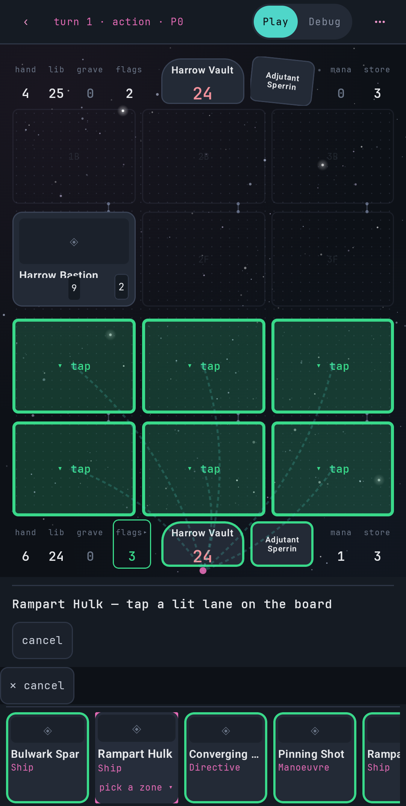
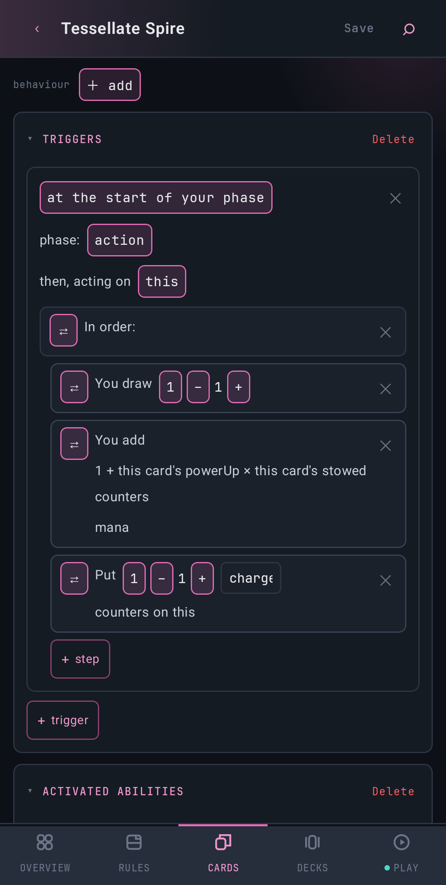
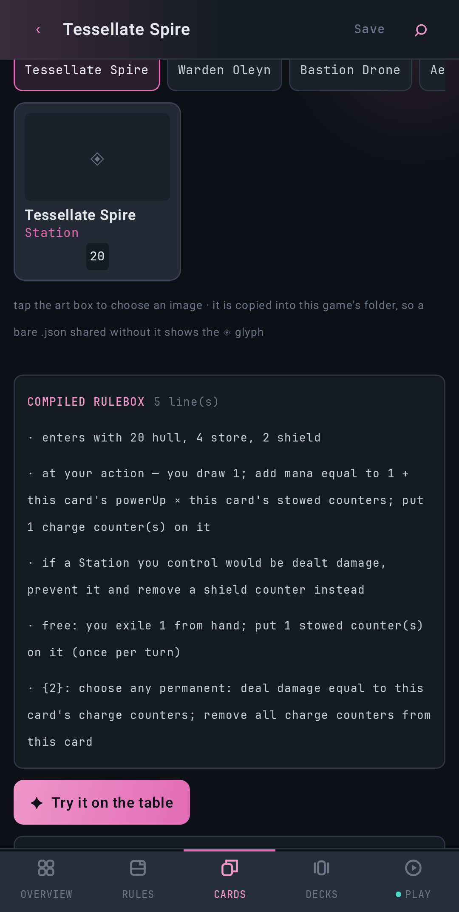

# CardEngine v3

A rules engine for trading card games, and an Android app for authoring and
playing them. A game is data: its rules, card sets and decks in one JSON file.
The engine is written in Kotlin and plays any game in that format. The app's
Creator edits the file, and its hotseat table plays it. The bundled samples play
like MTG, Yu-Gi-Oh, Star Wars Unlimited, One Piece and Hearthstone, and each uses
a different combat model. The project also ships its own game, EPR Skirmish.

Scope is games playable on paper. This is a personal prototype,
developed on-device in Termux.

## Why

A card game's rules are a small language: triggers, targets, costs, timing.
CardEngine treats them as one. Rules are compiled, not hard-coded, so one engine
plays games with different combat models, and a game file that names a card or
zone that does not exist fails with a located message instead of misplaying.
State is immutable and seeded, so every game can be replayed and undone exactly,
and the conformance corpus pins that behaviour down for any second
implementation.

<p>



</p>

## Guides

- [User guide](docs/guide/user-guide.md): the app, creating a game step by step,
  playtesting and playing.
- [Developer guide](docs/guide/developer-guide.md): principles, architecture,
  toolchain and build, and how to extend the rules language.

## Layout

| Path | Package | What | May depend on |
|---|---|---|---|
| `src/ccg/` | `ccg` | The engine: effect AST, compiler, interpreter, state, combat, JSON codecs | `kotlin-stdlib` only |
| `src/ui/` | `ccgui` | UI decision logic: legal taps, pilots, play sessions, replay | stdlib + `ccg` |
| `src/com/ccg/` | | The Compose app: Creator, hotseat table, bundled games | anything |
| `agent/` | | `cge` CLI, stdio MCP server, balance and probe tools | stdlib + `ccg` + `ccgui` |
| `test/` | | The suite, a hand-rolled harness (no JUnit) | |
| `godot-poc/` | | A Godot proof of concept: the bundle over a loopback socket ([README](godot-poc/README.md)) | |

The first two dependency rules are enforced by `test.sh` and `build.sh`
.

## The pipeline

A game file (`GameDoc`) goes through `GameDoc.compile()` (`src/ccg/Compile.kt`).
Compiling resolves every name to a declaration, reports problems as located
diagnostics, and lowers surface forms to the core AST (`Lower.kt`). The result is
`Rules`, which the interpreter runs.
- **State** is an immutable `GameState` that carries its own RNG. The same seed
  and the same answers always produce the same game.
- **Play sessions** are stored as that seed, the deck picks and the answers.
  Undo, replay and bot games are all derived from it.
- **Legality** is answered by one `legality()` function, for the engine, the UI
  and the bots alike.

## Build and test

```bash
bash test.sh        # the gate, ~4 min: guards, then every suite (host JVM, no Android)
bash build.sh       # the signed APK at out/apk/app-signed.apk, ~4 min
bash agent/build-agent.sh && ./agent/balance epr 2   # CLI + a balance matrix
```

The toolchain is a hand-rolled Kotlin, Compose and aapt2 pipeline for Termux.
Gradle only resolves external dependencies (`build.gradle.kts`); it does not
build. Pushes to `master` build and publish the APK in GitHub Actions
(`.github/workflows/apk.yml`).

## Generated, committed, drift-checked

These files are written by the code. The suite fails if a committed copy differs
from what the code produces now. Regenerate one only when the change is deliberate,
and say why in the commit.

| File | What | Regenerate |
|---|---|---|
| `docs/schema/cardengine.schema.json` | JSON Schema for game files and answers | `CGE_WRITE_SCHEMA=1 bash test.sh` |
| `content/*.json` | The bundled games (`index.json` lists them) and `combat/presets.json`, the combat preset library. These ARE the source: edit them directly, or export from the Creator | `CGE_WRITE_CONTENT=1 bash test.sh` normalises them to the codec's form |
| `corpus/*.json` | Conformance corpus: each bundled game's matches, with the answers and a state digest after each one | `CGE_WRITE_CORPUS=1 bash test.sh` |
| `test/golden/replay.txt` | How all 46 bundled matches end; the reference for "this change alters no game" | `CGE_WRITE_REPLAY=1 bash test.sh` |
| `test/golden/rng.txt` | The RNG's test vector, from an independent Python implementation (`test/golden/mulberry32.py`) | `python3 test/golden/mulberry32.py > test/golden/rng.txt` |

The content files and the corpus are what a second implementation of the rules
reads. Such a port conforms when it
reproduces every state digest in the corpus. The digest is defined in
`src/ccg/Digest.kt`.

## About this repository

Developed in a private repository and published here as snapshot commits, so
the history is short by design.

## License

Copyright (C) 2026 Richard Schmidt.

- **Code** (everything not listed below) is licensed under the GNU Affero
  General Public License, version 3 or any later version: see [LICENSE](LICENSE).
  If you run a modified version as a service others use over a network (a game
  server, the agent tools), you must offer them its source.
- **Game content and documentation** (`content/`, `corpus/`, `docs/guide/` and
  `CorpusCoverage.md`) are licensed under Creative Commons Attribution 4.0
  International: see [LICENSE-CONTENT](LICENSE-CONTENT).
- The bundled **JetBrains Mono** font (`res/font/`) is licensed under the SIL
  Open Font License 1.1: see [licenses/JetBrainsMono-OFL.txt](licenses/JetBrainsMono-OFL.txt).

The sample games imitate the mechanics of well-known card games to show that
the engine can play them. This project is not affiliated with those games, and
their names are trademarks of their owners.
